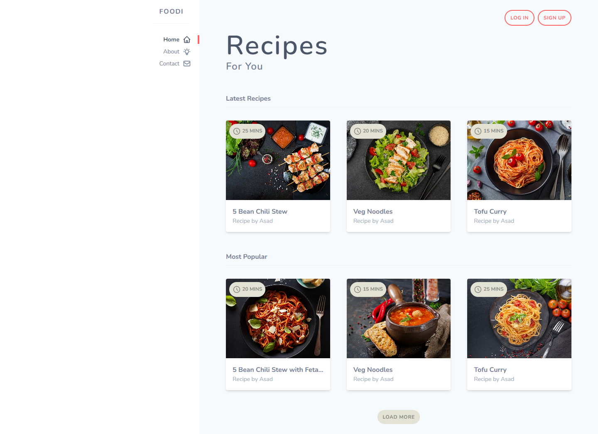

# Foodi website

✨Responsive Foodi website with Tailwind.
- Using Tailwindcss to style this website.
- Using icon from https://heroicons.dev/
- In this project we customized colors and fonts by editing tailwind config file.

- Tutorial for this project was from youtube channel the Net Ninja. 
[▶️ Tutorial video from the Net Ninja](https://www.youtube.com/watch?v=bxmDnn7lrnk&list=PL4cUxeGkcC9gpXORlEHjc5bgnIi5HEGhw)

--------------------------------
