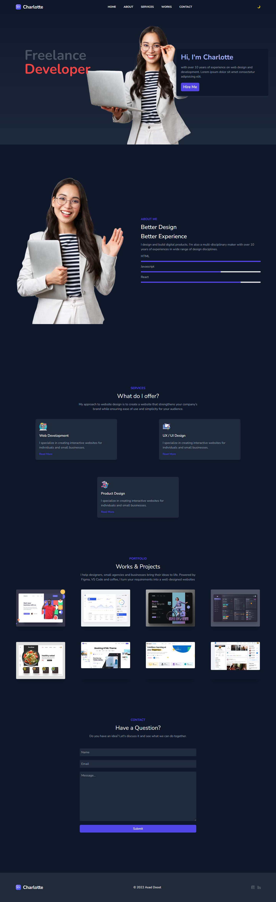

# Portfolio website

✨Responsive Portfolio website with Tailwind.
- Using Tailwindcss to style this website.
- Dark mode
- Mobile first design
- In this project we customized font and sizes by editing tailwind config file.

- Tutorial for this project was from youtube channel Lama Dev. 
[▶️ Tutorial video Link](https://www.youtube.com/watch?v=4zHNGNCIezY&t=14s)

--------------------------------
